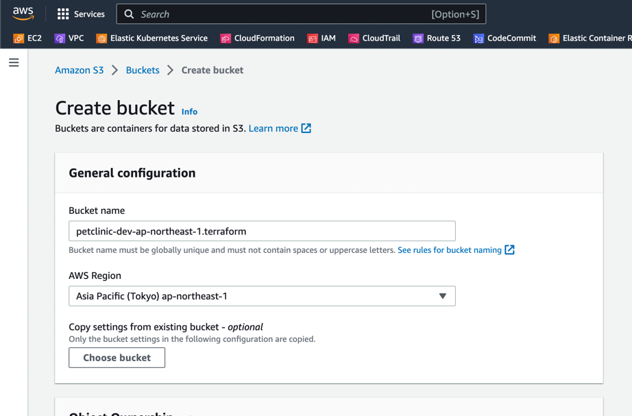
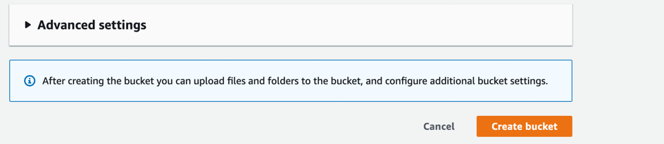

## Before you begin
- Prepare a domain in route53, we are going to use dev.nt2data.com as sample in this article
- Create s3 bucket for terraform 
- Prepare a certificate with ACM for each region, the domain would be dev.nt2data.com, *.dev.nt2data.com

In this sample, we use nt2data.com as domain, 
also we created petclinic-dev-ap-northeast-1.terraform s3 bucket to save the terraform state

### How to create s3 bucket
- Input the s3 bucket name

- Click button Create bucket

## Note
### Creating
- The total time of creating would be about 20 minutes
- Create certificate if there is no certificate in the particular region for dev.nt2data.com.
- Copy the `copyme` folder in the same directory, prefer to name the new folder name with a short name.
- Change the prj_code in the variables.tf at the beginning, make sure you have uniq identifier for this.
- Change the terraform s3 bucket name in the main.tf, make sure the name is uniq, we recommend to use the prj_code.
### Destroying
- When we do terraform destroy, we maybe need to delete some resources manually. Just follow the terraform instructions.
- We need to go route 53 hosted zone to delete the petclinic domain manually. It's also OK to leave it there is no cost and no effects to any system

## Resource list
### AWS Resources
- VPC and subnets along with igw,nat etc
- EKS
- EC2 instance 2 m5.xlarge
- Security groups
- key pair
### K8S Resources
- AWS Loadbalancer Controller
- External DNS
- petclinic service related resources
